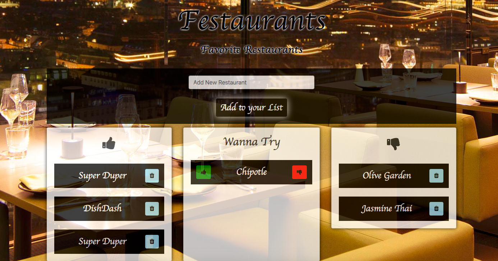

# Restaurants MVC

## About
This is a full-stack web application using MVC architecture and node.js,express,mysql,handlebars wherein user can keep a track of his favorite restaurants. He can enter the restaurant names he wishes to visit. Once he visits, he can either like or dislike the restuarant. At any time, user can see all the restaurants that are unvisited, liked or disliked by the user.

## Deployed Link
[Restaurants_MVC](https://restaurant-list-1.herokuapp.com)

## Application Preview


## Technologies used
1. Node.js
2. Express
3. MySQL
4. Handlebars

## Node Packages used
1. express
    * usage
    ```require("express")```
    * It is a fast, unopinionated, minimalist web framework for node.
    * For more information: [express](https://expressjs.com)

2. mysql
    * usage
    ```require("mysql")```
    * A node package that is used to connect to mysql server and thus allows us to run queries on database tables; It also aloows us to delete, update or insert into the database tables.
    * For more information: [mysql](https://www.npmjs.com/package/mysql)

3. body-parser
    * usage
    ```require("body-parser")```
    * Node.js body parsing middleware.Parses incoming request bodies in a middleware before handlers, available under the req.body property.
    * For more information: [body-parser](https://www.npmjs.com/package/body-parser)

4. express-handlebars
    * usage
    ```require("express-handlebars")```
    *  lets one build semantic templates effectively. It is logic-less and keeps the views and logic separated.
    * For more information: [express-handlebars](https://www.npmjs.com/package/express-handlebars)

## Execution steps on local machine
1. Make sure node is installed on your machine. You can visit the website [Node Installation](http://blog.teamtreehouse.com/install-node-js-npm-mac) for instructions.
2. Download/Clone the respository.
3. On terminal, go inside Restaurants_MVC folder and type npm install. This will install all the dependencies required to run the application mentioned in package.json.
4. Make sure mysql is installed on the localhost/other server. 
5. Log into mysql workbench and execute db/schema.sql followed by db/seeds.sql from the repository.
6. Open config/connection.js and change createConnection function's parameter in all 3 places. Replace the configuartion keys with your values.
7. Inside Restaurants_MVC folder on terminal, type "node server.js" on terminal. This will start the server.
8. Open the browser and type "localhost:8080". This will start executing the client part of the application.

## Mysql Tables
### restaurants:

Column Name  | Type
------------ | -------------
id (Primary key) | INTEGER AUTO_INCREMENT NOT NULL
name | VARCHAR(50) NOT NULL
visited | BOOLEAN DEFAULT false
liked | BOOLEAN DEFAULT false

## Code snippets

### server
```
var exphbs = require("express-handlebars");
app.engine("handlebars", exphbs({ defaultLayout: "main" }));
app.set("view engine", "handlebars");

var routes = require("./controllers/restaurants_controller.js");

app.use("/",routes);
```
This code snippet show how to set the handlebars, how server gets the access to the controllers and how we set the route.

### model
```
var restaurant = {
  all: function(cb) {
    orm.selectAll("restaurants", function(res) {
      cb(res);
    });
  }
}
```
The model creates an object that has all the necessary information required for it to interact with the database. In this case we are using ORM to actually implement the functionalities under the hood.

```
var orm = {
    selectAll: function(tableInput, cb) {
    var queryString = "SELECT * FROM " + tableInput + ";";
    connection.query(queryString, function(err, result) {
      if (err) {
        throw err;
      }
      cb(result);
    });
  }
}
```
Here in ORM, under the hood, we actually write the query and interact with the database server. Then this get exported to the model and model creates the object that uses orm's functions underneath.

### view
```
<body>
	{{{ body }}}
</body>
```
On server.js, we mentioned main.handlebars to be loaded at the start. This has a placeholder {{{body}}} for the main content to be rendered. Other handlebars are rendered based upon the routes in the controller.

```
{{#each restaurants}}
    {{#unless visited}}
        {{> restaurants/unvisited-block}}
    {{/unless}}
{{/each}}
```
This is to extract all the unvisited restaurants from the all teh restaurants returned by the database server. It renders unvisited-block.handlebars and prints these restaurants in that block

```
{{#each restaurants}}
    {{#if visited}}
        {{#if liked}}
            {{> restaurants/liked-block}}
        {{/if}}
    {{/if}}
{{/each}}
```
From the database's response of all restaurants, for each restaurant above code snippet first checks if the restaurant is visited or not. If yes, it then checks if user has liked it or displiked it. It accordingly renders the restaurant using the appropriate handlebar.


### controller
Controller has all the information about the model and it according to the requests renders appropriate view.

```
router.get("/", function(req, res) {
  restaurant.all(function(data) {
    var hbsObject = {
      restaurants: data
    };
    console.log(hbsObject);
    res.render("index", hbsObject);
  });
});
```
When the clinet makes a request to root route, controller uses model to run its .all()function that returns all the restaurants' data and it then renders index.handlebars with this data.

```
router.post("/api/restaurants", function(req, res) {
    restaurant.create([
    "name"
  ], [
    req.body.name
  ], function(result) {
    // Send back the ID of the new quote
    res.json({ id: result.insertId });
  });
});
```
When the client sends a post request to the server, controller uses model to run its .create() function that inserts all the posted data into the database.

```
router.put("/api/restaurants/:id", function(req, res) {
  var condition = "id = " + req.params.id;

  console.log("condition", condition);

  restaurant.update({
    visited: req.body.visited,
    liked:req.body.liked
  }, condition, function(result) {
    if (result.changedRows == 0) {
      // If no rows were changed, then the ID must not exist, so 404
      return res.status(404).end();
    } else {
      res.status(200).end();
    }
  });
});
```
When the client sends an update request to the server, it send the ID of the restaurant it wants to update along with the new values. Controller uses model's .update() function to update the database.

```
router.delete("/api/restaurants/:id", function(req, res) {

    restaurant.delete(
    {id:req.params.id},
    function(result){
      if (result.affectedRows === 0) {
        // If no rows were changed, then the ID must not exist, so 404
        return res.status(404).end();
      } else {
        res.status(200).end();
      }
    });
  });
```
When the client sends a delete request to the server, it send the ID of the restaurant it wants to delete. Controller uses model's .delete() function to delete the restaurant from the database.

### Client
```
$.ajax("/api/restaurants/" + id, {
    type: "PUT",
    data: newRestaurantState
}).then(
    function() {
    location.reload();
    }
);
```
Client sends an update request to server using ajax PUT method. It sends along the ID of the restaurant in the query paramaters and the new values in the request body. This triggers router.put() within the controller.

```
$.ajax("/api/restaurants/"+id, {
        type: "DELETE"
      }).then(
        function() {
          location.reload();
        }
      );
```
Client sends a delete request to server using ajax DELETE method. It sends along the ID of the restaurant in the query paramaters. This triggers router.delete() within the controller.

```
$.ajax("/api/restaurants", {
            type: "POST",
            data:{name:name}
          }).then(
            function() {
              location.reload();
        });
```
Client sends a insertion request to server using ajax POST method. It sends along new values in the request body. This triggers router.post() within the controller.


## Learning points
1. Creating a full stack web application.
2. Learning how the server and client interact with requests and responses.
3. How to create a server and how it starts listening for the clients' requests on a particular port.
4. How the models, controllers and views interact in MVC architecture. We made heavy use of callbacks in this app for this interaction.
5. Various types of ajax client requests i.e post,get,put,delete to database server
6. Sending various types of responses to clients including serving an html page/handlebar or sending back data as json object.
7. How to query on custom API data using a req.body or req.params
8. Using mysql package to interact with mysql server. This included creating connection, querying and using results in callback.
9. Using Object Relation Mapping, ORM.It creates a "virtual object database" that can be used from within the programming language.


## Author 
* [Ajita Srivastava Github](https://github.com/ajitas)
* [Ajita Srivastava Portfolio](https://ajitas.github.io/Portfolio/)

## License
Standard MIT License


